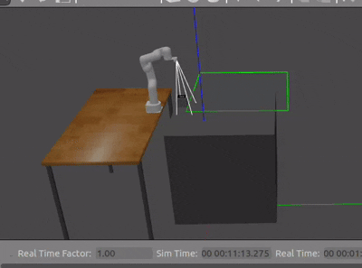

# xArm Lite6 ROS 2 Simulation

This repository provides a **ROS 2 workspace** for the **xArm Lite6** robotic arm, including MoveIt 2 integration, Gazebo simulation, perception with RealSense D435i, and a pick-and-place demo.

---

##  Installation

Follow the official documentation to install the Lite6 ROS 2 packages and dependencies. Ensure your workspace is properly built before launching any nodes:

```bash
cd ~/dev_ws
colcon build 
source install/setup.bash
```

launch  for opening  Gazebo abd Rviz2 in ros2 
ros2 launch xarm_moveit_config lite6_moveit_gazebo.launch.py add_realsense_d435i:=true
this will open gazebo rviz and a popup gui for camera feed (imshow)

xarm_ros2/
├─ attach_detach/
├─ msg_gazebo/
├─ parol6_pipeline/
├─ xarm_description/
├─ xarm_gazebo/
├─ xarm_moveit_config/

use this files insted of xam

Start Pick-and-Place

Call the pick-and-place service:  

```bash
 ros2 service call /start_picking std_srvs/srv/Trigger
 ```

Attach an Object

Attach a box to the robot’s end-effector:

```bash
ros2 service call /AttachDetach msg_gazebo/srv/AttachDetach "{model1: 'UF_ROBOT', link1: 'link6', model2: 'aruco_box', link2: 'link_0', attach: true}"
```

Detach an Object

Detach the box from the end-effector:

```bash
ros2 service call /AttachDetach msg_gazebo/srv/AttachDetach "{model1: 'UF_ROBOT', link1: 'link6', model2: 'aruco_box', link2: 'link_0', attach: false}"
```

## Demo Video

Here is a demonstration of the system:



## Documentation

For detailed documentation, see the PDF:

[Download iHub Documentation](I%20HUb%20.pdf)
